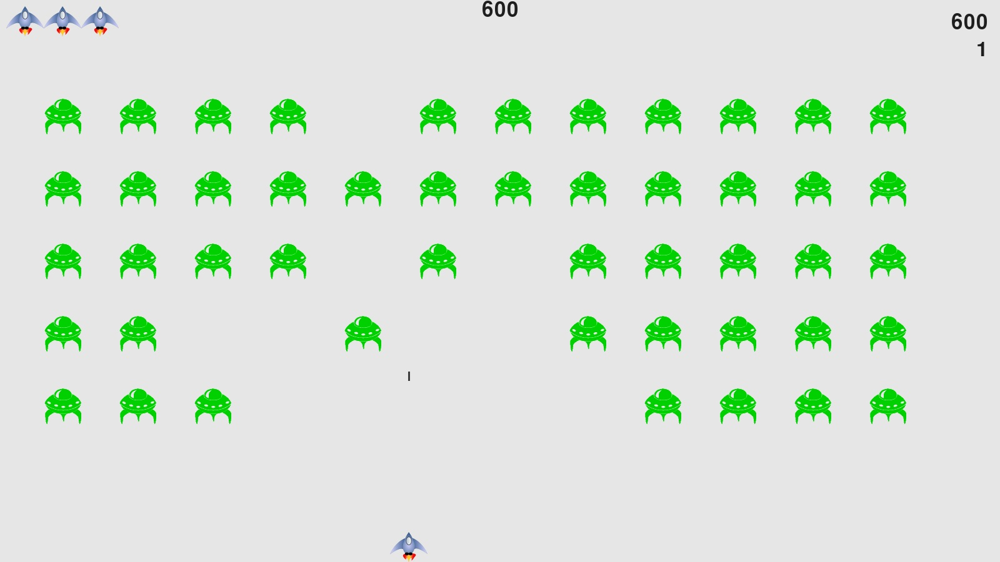

# AlienInvasion
___


Игра "Инопланетное вторжение".
Уничтожайте корабли пришельцев, и зарабатывайте очки.



## Настройка перед запуском

Первое, что нужно сделать, это cклонировать репозиторий:

```sh
$ git clone https://github.com/Andrei2020-web/AlienInvasion.git
$ cd alien_invasion
```

Создайте виртуальную среду для установки зависимостей и активируйте ее:

```sh
$ virtualenv venv
$ source venv/bin/activate
```

Затем установите зависимости:

```sh
(venv)$ pip install -r requirements.txt
```